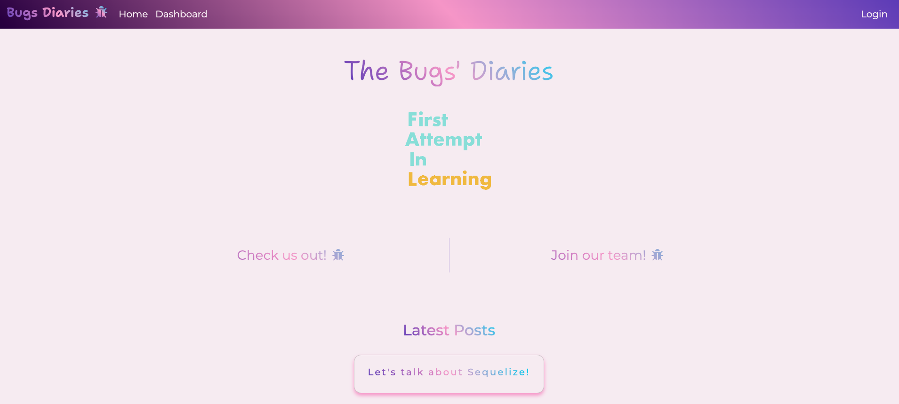
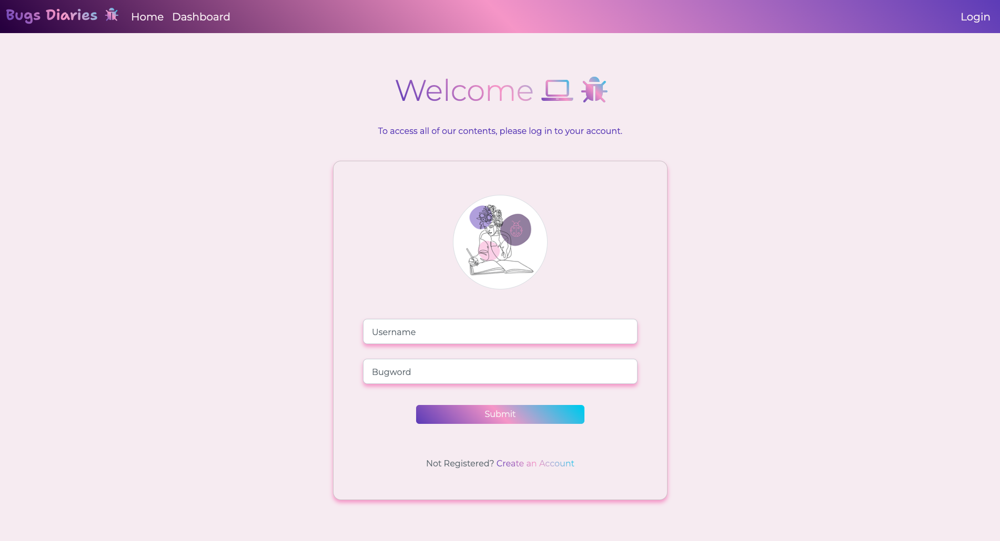
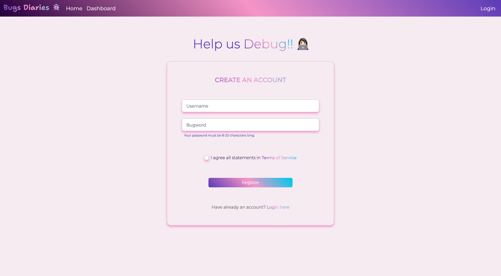

<h1 align="center"> Bugs Diaries </h1>

<p align="center">
    
  <br><br>
  <i> Share insights, tips, 
    <br> and news related to technology! </i>
  <br>
</p>

<p align="center">
  <a href="https://bugs-diaries.herokuapp.com/"><strong> Bugs Diaries Official Site </strong></a>
  <br>
</p>

<br>

<div align="center">


</div>

---

## Description

Bugs Diaries allows writers to publish, edit, and manage their articles with ease. They can format their content using a variety of styling options. The site also has a commenting system that enables readers to interact with authors, ask questions, and share their thoughts.

This blog site is constantly updated with new content, ensuring that developers always have access to the latest information on technology trends, best practices, and emerging technologies. With its rich collection of articles, the Bugs Diaries site is an invaluable tool for anyone looking to stay informed and stay ahead in the ever-evolving world of technology.

## Table of Contents

- [Description](#description)
- [Table of Contents](#table-of-contents)
- [Installation](#installation)
  - [Cloning the Repository](#cloning-the-repository)
  - [Prerequisites](#prerequisites)
  - [Setting Up](#setting-up)
- [Mock-Up](#mock-up)
- [Usage](#usage)
- [Questions](#questions)
- [Contributing](#contributing)
  - [Contributing Guidelines](#contributing-guidelines)
  - [Code of Conduct](#code-of-conduct)
- [Credits](#credits)
  - [Authors](#authors)
  - [Acknowledgements](#acknowledgements)
- [License](#license)

## Installation

### Cloning the Repository

Click `<> code` - the green button. After clicking, in the local tab, copy the SSH key. Open the terminal in your Macbook or [git bash](https://git-scm.com/downloads), if you have Windows/Linux, and type:

```bash
git clone [paste ssh key]
```

I would recommend downloading [Visual Studio Code](https://code.visualstudio.com/download) to edit the code locally. If you need more information on how to clone a repository, [click here](https://docs.github.com/en/repositories/creating-and-managing-repositories/cloning-a-repository)!

### Prerequisites

This package requires you to have [Node.js](https://nodejs.org/en/download/), npm, Inquirer, [Express.js](https://expressjs.com/) and [MySQL2](https://www.npmjs.com/package/mysql2) installed on your machine. You can install these by running the code below on your terminal:

For `npm`

```bash
curl -o- https://raw.githubusercontent.com/nvm-sh/nvm/v0.39.3/install.sh | bash
```

For `Node.js`

```bash
npm i node@lts
```

For `Express.js`

```bash
npm i express
```

### Setting Up

Open the project in VS Code and make sure you are in the directory of this application before installing the dependencies. To install it, type the commands below on your terminal:

For `MySQL2`

```bash
npm i mysql2
```

For `Sequelize`

```bash
npm i sequelize
```

For `Express Handlebars`

```bash
npm i express-handlebars
```

For `Express Session`

```bash
npm i express-session
```

For `Connect Session Sequelize`

```bash
npm i connect-session-sequelize
```

For `bcrypt`

```bash
npm i bcrypt
```

For `dotenv`

```bash
npm i dotenv
```

You can also open the project in VS Code, make sure you are in the directory of this application and then type the command below on your terminal:

```bash
npm i
```

Once you run this, npm will begin the installation process of all of the current project's dependencies.

## Mock-Up

The following images shows the web application's appearance:







## Usage

Launch the application by entering the command below on your terminal:

```bash
npm start
```
And then have fun in your browser!

## Questions

For questions and support feel free to contact me via:

<a href="mailto:larigens@gmail.com">📧 Email </a>

<a href="https://github.com/larigens">🐈‍⬛ GitHub </a>

## Contributing

### Contributing Guidelines

Want to report a bug, contribute some code, request a new feature, or improve the documentation? You can submit an issue and we will gladly review it, but before submitting an issue, please search the issue tracker, as it may already exist!

### Code of Conduct

Our Code of Conduct follows the same principles as the [Contributor Covenant](https://www.contributor-covenant.org/version/2/1/code_of_conduct/), version 2.1.

## Credits

### Authors

👩🏻‍💻 <a href="https://github.com/larigens"> Larissa Guilherme </a>

### Acknowledgements

- [W3 Schools](https://www.w3schools.com)
- [MDN](https://developer.mozilla.org/en-US/)
- [Node.js](https://nodejs.org/en/)
- [NPM](https://www.npmjs.com/)
- [README Lab](https://github.com/larigens/readme-lab)
- [Express.js](https://expressjs.com/en/4x/api.html)
- [MySQL](https://dev.mysql.com/doc/)
- [MySQL2](https://www.npmjs.com/package/mysql2)
- [Stack Overflow](https://stackoverflow.com/)
- [dotenv](https://www.npmjs.com/package/dotenv)
- [Sequelize](https://www.npmjs.com/package/sequelize)
- [bcrypt](https://www.npmjs.com/package/bcrypt)
- [Express Session](https://github.com/expressjs/session#readme)
- [Express Handlebars](https://github.com/express-handlebars/express-handlebars)
- [Connect Session Store using Sequelize](https://github.com/mweibel/connect-session-sequelize)
- [Handlebars](https://handlebarsjs.com/guide/builtin-helpers.html#with)
- [Postman API](https://www.postman.com/)
- [Insomnia](https://insomnia.rest/)
- [Passport](https://www.npmjs.com/package/passport)

## License

Please refer to the [LICENSE](https://choosealicense.com/licenses/apache-2.0/) in the repo.
